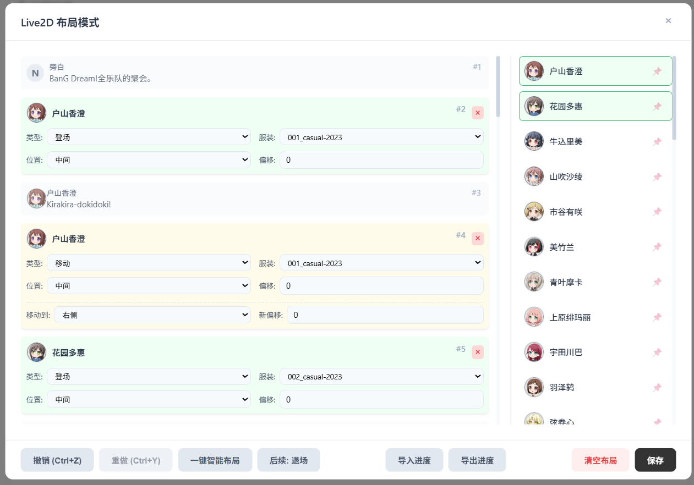
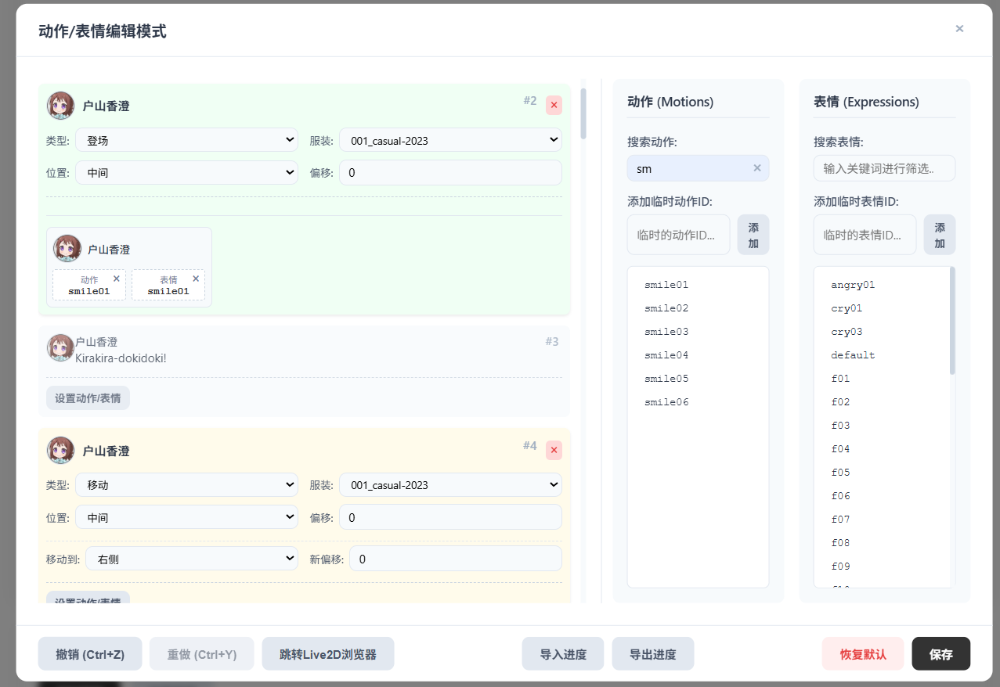

# BanG Dream! 剧情文本转换器

这是一个为 BanG Dream! (Bestdori) 社区设计的SPA页面工具，可以将繁琐的剧情编辑流程转变为便捷操作，能将对话文本转换为 Bestdori 平台可用的JSON格式。

通过这个工具，你可以直接把已写好的剧情文本导入到Bestdori里快捷编辑，不用一句一句地复制文本、设置角色名字、图标、Live2D服装、Live2D布局、设置角色动作表情和对话内容。

注意：生成的JSON仅为初稿，还需要自行完善音乐、背景等配置。这个工具只是为了在发布剧情到Bestdori时，简化一部分频繁使用的操作，让剧情编辑更加便利，节约时间，所以它并不会包含全部的Bestdori剧情编辑器的功能。

---

## 核心功能

### 1. 文本转换
- **多格式输入**: 支持直接粘贴文本，或上传 `.txt`、`.docx`、`.md` 格式的剧本文件。
- **自动识别**: 自动识别“角色名：对话”格式的文本，并将其余部分处理为旁白。
- **引号处理**: 预设常用引号，支持添加自定义引号对，实现对引号的自动清理。

### 2. 对话编辑器
- **拖拽指派**: 可以通过从右侧角色列表拖拽到左侧对话卡片的方式，为对话指派或修改说话人。
- **多人对话**: 支持为一句对话指派多个说话人。
- **多选模式**: 支持一键切换多选模式，批量为卡片指派说话人。

<p align="center">
  
  <br>
  <em>对话编辑器界面</em>
</p>

### 3. Live2D布局编辑器
- **拖拽生成布局**: 从角色列表拖拽角色到对话卡片列表里，创建 `登场`、`移动` 或 `退场` Live2D布局卡片。
- **参数配置**: 在布局卡片上可以自行设置角色的**服装、出场位置、目标位置和偏移量**。
- **自动布局**: 根据角色首次发言自动生成登场动作。

<p align="center">
  
  <br>
  <em>Live2D 布局编辑器界面</em>
</p>

### 4. 动作/表情编辑器
- **动作表情控制**: 在列表中为**每一句对话**或**每一个布局动作**设置在场角色的动作或表情。
- **拖拽设置**: 从右侧的动作表情列表中将指定的 `动作` 或 `表情` ID 拖拽到对应角色的状态栏中完成设置。
- **动作表情列表**: 动作表情列表会显示当前在场角色所有可用的动作和表情，可以临时添加和快捷搜索。

<p align="center">
  
  <br>
  <em>动作/表情编辑器界面</em>
</p>

### 5. 角色与服装系统
- **角色管理**: 内置目前 BanG Dream! 46个乐队角色，支持自定义角色别名。
- **服装管理**:
    - 为每个角色独立管理可用的服装列表。
    - 可从预设列表中选择，也可添加任意自定义服装ID。
    - 可为每个角色设置默认服装，在自动布局时自动应用。

### 6. 配置管理
- **位置配置**: 可以为每个角色设置默认的登场位置和偏移。
- **全局动作表情列表**: 可以添加全局的自定义动作/表情ID(主要用于Live2D动作表情的查缺补漏)。
- **配置导入/导出**: 导出包含角色映射、服装、位置、引号等所有用户配置的JSON文件。

### 7. 导入导出工作进度
- **项目文件**: 支持**导入和导出**，方便保存整个剧情的编辑进度。
- **本地存储**: 角色映射、服装、位置、自定义引号等所有用户配置都会自动保存在浏览器本地。

---

## 技术栈
- **前端**: 原生 JavaScript (ESM)
- **后端**: Python (Flask)

---

## 安装与运行

### 环境要求
- Python 3
- pip (Python 包管理器)

### 安装步骤
1.  **确保系统已安装 Python 3**
    ```bash
    # 检查 Python 版本
    python --version
    # 或
    python3 --version
    ```

2.  **克隆仓库**
    ```bash
    git clone https://github.com/Yulinanami/Bestdori_WebTextConverter
    cd Bestdori_WebTextConverter
    ```

3.  **创建虚拟环境**
    ```bash
    python -m venv .venv
     # 或
    python3 -m venv .venv
    ```

4.  **激活虚拟环境**
    ```bash
    .\.venv\Scripts\activate
    # 或
    source .venv/bin/activate
    ```

5.  **安装依赖**
    ```bash
    pip install -r requirements.txt
    ```

6.  **启动项目**
    ```bash
    # 运行应用
    python run.py
    # 或
    python3 run.py
    ```

---

##  许可证

使用MIT license
